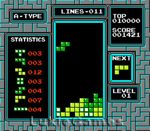
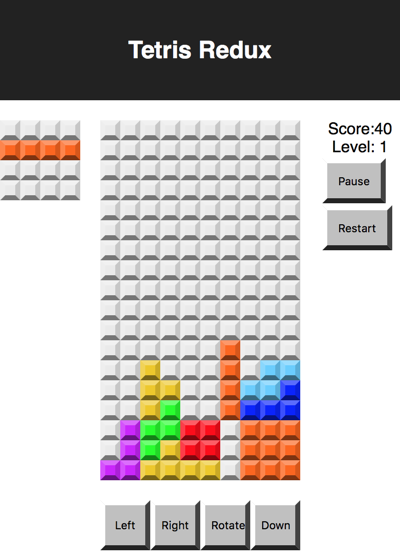
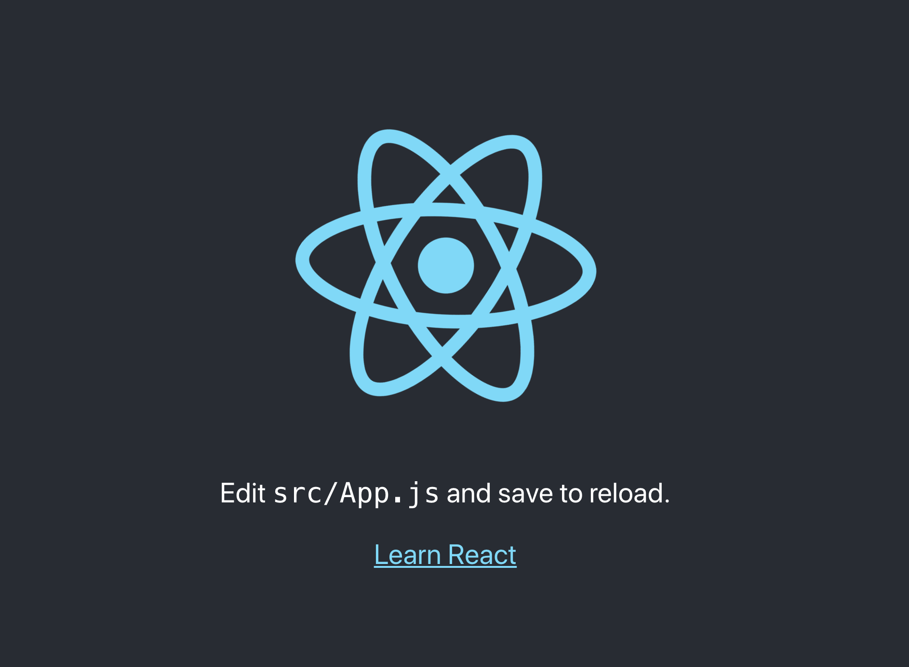
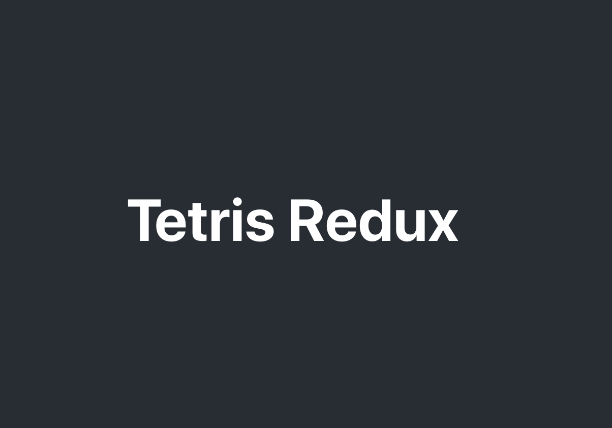

This tutorial uses React and Redux to recreate the classic
arcade game Tetris.

Tetris is a classic arcade game that was originally designed
and programmed by Russian game designer [Alexey Pajitnov](https://en.wikipedia.org/wiki/Alexey_Pajitnov).
It was released on June 6, 1984.

The game, or one of its many variants, is available for nearly
every video game console and computer operating system, as well
as on devices such as graphing calculators, mobile phones,
portable media players, PDAs, Network music players and as an
Easter egg on non-media products like oscilloscopes.

Here is what Tetris looked like on an arcade machine in the
80s.



Here is what we will build with this tutorial. This version of
Tetris will run in any web browser that supports JavaScript.



# Prerequisites

To complete this tutorial you should have some experience with
the JavaScript Language and React by completing the [timers app tutorial](https://www.makeschool.com/academy/track/react-redux-passwords-app-tutorial-oh4)

Some experience working with the command line, including NPM
and Node.

# Overview

The goal of the project is to recreate the classic arcade game
Tetris with React and Redux.

React will generate and manage the views in the project while
the state of the game will be stored in Redux.

The game is controlled by a nested array that represents the
grid containing all of the blocks.

The tutorial will also delve into related topics like CSS,
CSS Grid, and Flex Box.

# Learning Outcomes

By the end of this tutorial, students should be able to...

1. Build more advanced React components using JSX syntax
1. Manage application state using the Flux pattern
1. Implement the foundation of a game using nested arrays
1. Integrate CSS variables into their stylesheets for more DRY code
1. Practice advanced CSS techniques to render elements in the browser

# Technical Planning

We're going to build this game up component by component, then implement our actions and reducers, and tie it all together. We'll also be styling as we go along as well. At a high level, here's our plan to follow:

1. Implement the overall grid square
1. Implement the game board
1. Implement the "next block" area
1. Implement the score board
1. Arrange the layout of the game
1. Implement the controls
1. Implement the message popup
1. Implement the actions and reducers
1. Do some code organizing and cleanup
1. Implement state and shapes
1. Connect each component up to state and reducers
1. Implement block rotation
1. Implement moving blocks
1. Building a timer system
1. Implementing Game Over and Restart

# Using Git/GitHub

Much like we've done in earlier tutorials, make sure you're committing your code as you complete milestones. At a minimum, you should make a commit whenever the tutorial prompts you.

## Set Up Git/GitHub

Set up your repo!

>[action]
> Make your first commit
>
```bash
$ git init
$ git add .
$ git commit -m 'project init'
```

Now go to GitHub and create a public repository called REPO-NAME, and now associate it as a remote for your local git project and then push to it.

>[action]
> Push it!
>
```bash
$ git remote add origin GITHUB-REPO-URL
$ git push origin master -u
```

# Create a default app

First thing we need to do is get our default React app set up

> [action]
>
> Create a default app using Create React App. You can follow the instructions [here](https://github.com/facebook/create-react-app).
>
> Test your app with: `npm start` or `yarn start` to make sure everything is working.

You can visit the project in a browser at `http://localhost:3000/`. It should open at the this address automatically. If all went well, you should see the below in your browser:



# Clean up the Default Project

Clean up the default project by removing the header and default
content.

> [action]
>
> In `/src/App.js` edit the `render` method to provide the following JSX:
>
```html
<div className="App">
  <header className="App-header">
    <h1 className="App-title">Tetris Redux</h1>
  </header>
</div>
```
>
> Since we removed the logo we should remove the import for it:
> remove the `import logo from './logo.svg';` line from the top of `/src/App.js`
>
> Lastly, make a folder for components: `src/components`

# Test the changes

With the server running any changes you make to the code should
trigger the server to refresh automatically. You should now see the below in the browser:



# Adding Dependancies

Redux is a library that manages Application state. The React-Redux library acts as bindings between React and Redux. We will need to install both as dependancies.


> [action]
>
> Add Redux and React-Redux as a dependency to your project.
>
```bash
$ npm install --save redux react-redux
```

# Add some folders

This next step adds a couple folders to organize your code.

> [action]
>
> Make a folder for Actions: `src/actions`
>
> Then, make a folder for Reducers: `src/reducers`
>
> Finally, make another folder to hold some utility functions: `src/utils`

# Now Commit

>[action]
>
```bash
$ git add .
$ git commit -m 'proj setup complete'
$ git push
```


## Resources

- [React](https://reactjs.org)
- [Redux](https://redux.js.org)
- [npm](https://www.npmjs.com)
- [Node JS](https://nodejs.org/en/)
- https://github.com/facebook/create-react-app
- https://github.com/reduxjs/redux
- https://github.com/reduxjs/react-redux
