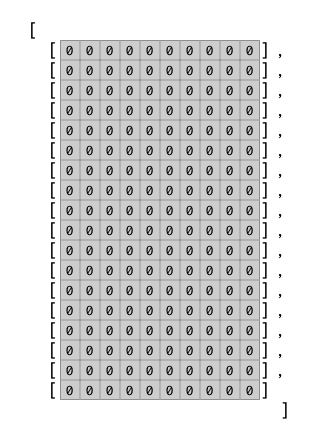
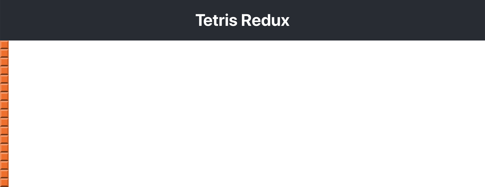
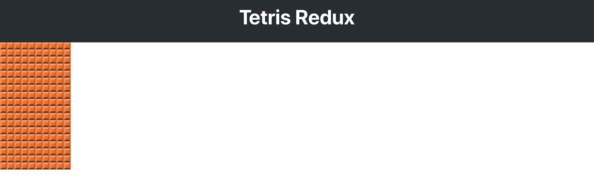

This section takes the grid square created in the last
section and displays them as a 10 x 18 grid.
This grid of squares will be a component.


Before we build out this grid, let's establish some initial requirements:

- The the main view of the game is made of a 10 x 18 grid.
- Each square on the grid is a single 20px x 20px square rendered from a grid square component.
- The main game logic has not been implemented yet so we will hard code the grid squares for now.
- The grid is made up of an array containing 18 arrays. Each of these arrays represent one row on the grid.
- Each row is an array containing 10 integers. Each integer represents the color displayed at that row and column.
- This a **two dimensional array**. You might visualize it like this
if all the squares contained color 0.



# Make the GridBoard Component

> [action]
>
> Make a new file `src/components/grid-board.js` and put the following code in it:
>
```js
import React, { Component } from 'react'
import GridSquare from './grid-square'
>
// Represents a 10 x 18 grid of grid squares
>
class GridBoard extends Component {
>
  // generates an array of 18 rows, each containing 10 GridSquares.
  makeGrid() {
    const grid = []
    for (let row = 0; row < 18; row ++) {
      grid.push([])
      for (let col = 0; col < 10; col ++) {
        grid[row].push(<GridSquare key={`${col}${row}`} color="1" />)
      }
    }
>
    return grid
  }
>
  // The components generated in makeGrid are rendered in div.grid-board
  render () {
    return (
      <div className='grid-board'>
        {this.makeGrid()}
      </div>
    )
  }
}
>
export default GridBoard
```

Now we should import `GridBoard` into `/src/App.js`

> [action]
>
> Change `/src/App.js` to the following:
>
```js
import React, { Component } from 'react';
>
[bold]import GridBoard from './components/grid-board'[/bold]
>
import './App.css';
>
class App extends Component {
  render() {
    return (
      <div className="App">
        <header className="App-header">
          <h1 className="App-title">Tetris Redux</h1>
        </header>
[bold]        <GridBoard />[/bold]
      </div>
    );
  }
}
>
export default App;
```

The grid squares should all end up stacked vertically:



# Use CSS Grid to arrange the squares

Now we'll use the CSS Grid to arrange the single row of grid squareas into an actual grid (what a concept!)

> [action]
>
> Add the following to `/src/index.css`:
>
```css
/* tells the browser to calculate the size boxes to include the border width rather than adding the border, which is the default */
* {
  box-sizing: border-box;
}
>
/* Grid Board - This defines the `grid-board` to display as `grid`. This causes the children of this element to arrange on a grid. The number of columns is set by `--cols` var and the width of each column is set by `--tile-size`. These two CSS custom properties are defined in `:root` which allow them to be easily changed.*/
.grid-board {
  display: grid;
  grid-template-columns: repeat(var(--cols), var(--tile-size));
  grid-gap: 0;
  align-self: flex-start;
}
```

You should now see a grid in your browser:



> [info]
>
> To read more about box-sizing, check out this resource on [CSS Box Model](https://developer.mozilla.org/en-US/docs/Web/CSS/CSS_Box_Model/Introduction_to_the_CSS_box_model).

# Now Commit

>[action]
>
```bash
$ git add .
$ git commit -m 'Added grid board'
$ git push
```

## Resources

- https://www.w3schools.com/css/css_grid.asp
- https://developer.mozilla.org/en-US/docs/Web/CSS/CSS_Box_Model/Introduction_to_the_CSS_box_model
