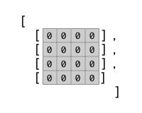

Tetris shows you the next block that will appear to 
the side of the game grid. This section makes a component 
for this purpose. 

# Introduction 

The next block will be displayed in a component that will 
draw itself as a 4 by 4 grid of grid squares. You can reuse the 
grid square component here. 

You might visualize the array that described the next block 
like this: 



Hey, it's just like the Grid Board array only smaller with 
4 rows and 4 columns. 

## Challenges

**Make the Next Block Component**

Make a new component: './src/components/next-block.js'.

Define the component like this: 

```jsx
import React, { Component } from 'react'
import GridSquare from './grid-square'

// Draws the "next" block view showing the next block to drop

class NextBlock extends Component {

  makeGrid() {
    const box = [[0,0,0,0], [0,0,0,0], [0,0,0,0], [0,0,0,0]]
    // Map the block to the grid
    return box.map((rowArray, row) => {
      return rowArray.map((square, col) => {
        return <GridSquare key={`${row}${col}`} color={0} />
      })})
    }

  render () {

    return (
      <div className="next-block">
        {this.makeGrid()}
      </div>
    )
  }
}
```

**Add styles for the Next Block**

Add some styles to arrange these into a grid. 

```css
/* Next Block */
.next-block {
  display: grid;
  grid-template-columns: repeat(4, var(--tile-size));
  align-self: flex-start;
}
```

At this point the page is lacking arranement but the tiles 
in each component are arranged in a grid. 

Notice the GridSqaures are using the default color 0. You 
will get the block shape as an array later and use this to 
set the color of the blocks. 

You can use CSS Grid to arrange the NextGrid and GridBoard 
components on the page also!

## Conclusion 

CSS Grid is a great tool for arrange elements in a two 
dimensional layout. 

## Resources

- 
