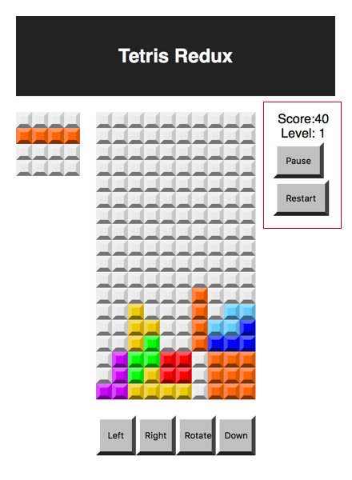

We need a score board to show the game score and 
provide a place for the play and pause buttons 
to live. 

The scoreboard when completed will display on the 
right side of the game board. 



# Introduction 

The score board component will display the game 
score. As blocks are placed when row is filled with colored 
squares the game scores points. 

The game also needs a button to pause game play and restart 
the game. 

As the game progresses you can speed up game play or make it 
more difficult in other ways the current level. 

The component you add in this step will give these elements 
a place to live. 


## Challenges

**Create the ScoreBoard Component**

Make a new file: './src/components/score-board.js'.

Setup the component: 

```jsx
import React, { Component } from 'react'

class ScoreBoard extends Component {

  render() {
    return (
      <div className="score-board">
        <div>Score:{ this.props.score }</div>
        <div>Level: 1</div>

        <button className="score-board-button" onClick={(e) => {

        }}>Play</button>


        <button className="score-board-button" onClick={(e) => {

        }}>Restart</button>

      </div>
    )
  }
}

export default ScoreBoard
```

Define some styles for these elements. No need to worry about 
the text now focus on the buttons. 

```css
/* Score Board */
.score-board-button {
  padding: 0;
  display: block;
  padding: 1em;
  border-width: 5px;
  border-top-color: var(--button-color-t);
  border-left-color: var(--button-color-l);
  border-right-color: var(--button-color-r);
  border-bottom-color: var(--button-color-b);
}
```

Notice we can use the variables here. 

This needs work, but we can take care the details later. 
For now this is good. 

## Conclusion 

Again CSS variables make our work more convient and flexible. 

The Score Board component holds information about the current
state of the game and controls that pause, resume, and 
restart the game. 

## Resources

