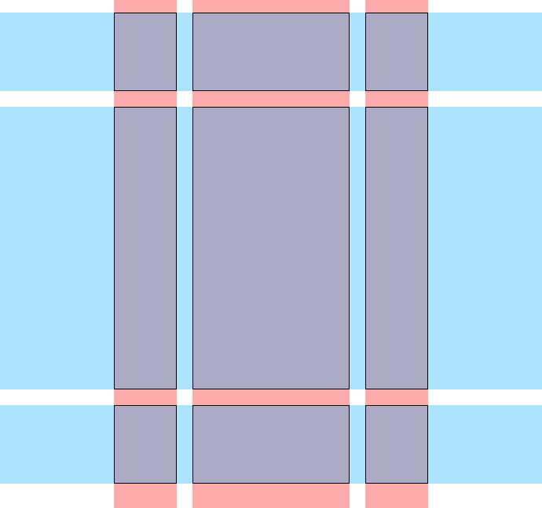

Arranging the large UI elements on the page will 
make the app easier to understand and look better.

# Introduction 

CSS grid is good for arranging the tiles in the
grid. CSS grid can also be used to arrange the 
larger UI element on the page as a whole. 

CSS Grid gives you control to arrange elements on 
a two dimensional grid. Elements can occupy multiple 
rows and/or columns. All of this is easily accomplished 
using a simple decalrative approach. 

## Defining a grid

A grid is a two dimension structure of columns and rows. 
Columns span vertically and rows span horizontally. 
In CSS we define the number of rows and columns, and the 
width of each column and the height of each row. 

The size of a column or row can be defined in any unit 
supported by CSS: `%`, `px`, `em`, `pt`, `mm`, `in`, cm etc. 
Columns and rows can also also be specified as a fraction 
of the available space with special unit: `fr`. 

The CSS grid module provides many options to define a grid. 
This discussion will focus on Grid Areas. Grid Areas 
are named collections of cells on the grid. 

## Defining a grid for the game

For the Tetris game the grid might have three columns and
three rows. This is main game layout that includes the 
Header, NextBlock, GridBoard, ScoreBoard, Buttons components. 

The Header will span all of the columns along the top. 

The NextBlock, GridBoard, and ScoreBoard will be side by 
side each taking a column. 

The Buttons will sit in the center column below the 
GridBoard. 

The size of the columns can be based on the size of the 
game tiles (20px). 

The columns will be 80px (20px * 4 columns), 200px (20px * 
10 columns), and 80px. 


There will be three rows. The top will 100px this will 
contain the Header. The center row will be sized to fit the
game grid 360px (20px * 18), and the bottom row will hold 
the buttons (which haven't been made yet) 100px.


Put these together and they look like this. A grid is a 
two dimensional it includes both columns and rows. 


The insection of Columns and Rows makes the grid Cells. 



CSS Grid allows you to define Grid Areas that span 
multiple Columns and Rows. The goal of the final layout is 
to place the header across the top three columns. 


The image shows 5 areas defined. 

- Header: displays the title
- Next: Shows the next block 
- Grid: Shows the game grid
- Score: Shows the game score
- Buttons: Shows the game buttons

Notice the cells in the lower left and right corner are 
not being used. 

The gap between cells is an option that can be set with 
CSS Grid. We will make that the sam size as one grid square. 

## Challenges

Define some styles to declare the main app container as a 
grid. This will layout it's children as grid items. 

Currently the app structure looks looks like this:  

- div.App
  - header.App-header
  - div.grid-board
  - div.next-block
  - div.score-board

Declare `.App` as a grid container and define some grid areas. 
The areas are just strings. I used the names: 

- h : Header
- l : Left 
- c : Center
- r : Right
- b : Buttons
- . : Is used to mark an empty cell

Add this to 'src/index.css'

```CSS
/* App */
.App {
  --col-side: calc(var(--tile-size) * 4);
  --col-center: calc(var(--tile-size) * 10);
  --grid-height: calc(var(--tile-size) * 18);
  
  width: calc(var(--tile-size) * (4 + 1 + 10 + 1 + 4));
  margin: auto;
  
  display: grid;
  
  grid-gap: var(--tile-size) var(--tile-size);
  grid-template-columns: var(--col-side) var(--col-center) var(--col-side);
  grid-template-rows: 100px var(--grid-height) 100px;
  
  grid-template-areas: "h h h"
                       "l c r"
                       ". b .";
}
```

Pay close attention to :

```CSS
grid-template-areas: "h h h"
                     "l c r"
                     ". b .";
```

This defines the areas on the grid with names: 'h', 'l', 'c', 'r', 
and 'b'. The '.' represents an empty cell on the grid. 

`grid-template-columns: var(--col-side) var(--col-center) var(--col-side);`

Defines three columns of `--col-side`, `--col-center`, and `--col-side` 
widths. 

`grid-template-rows: 100px var(--grid-height) 100px;` 

Defines three rows of `100px`, `--grid-height`, and 100px. 

Now assign child elements to grid areas in the parent. 

Assign the header a grid area. 

```CSS
/* App-header */
.App-header {
  grid-area: h;
}
```

Add the last line to the `.next-block` rule:

```CSS
/* Next Block */
.next-block {
  display: grid;
  grid-template-columns: repeat(4, var(--tile-size));
  align-self: flex-start;
  grid-area: l; /* Grid area l left column */
}
```

Do the same for the Grid. Add the last line to the rule. 

```CSS
/* Grid Board */
.grid-board {
  display: grid;
  grid-template-columns: repeat(var(--cols), var(--tile-size));
  grid-gap: 0;
  align-self: flex-start;
  grid-area: c; /* Assign to grid area c */
}
```

Last, set the area for the score board:

```CSS
/* score-board */
.score-board {
  grid-area: r;
}
```

## Conclusion 

This step used CSS Grid to layout the major UI element blocks. 
Using `grid-area` makes the the process easier manage. 

You used variables to define the width of UI blocks based on the 
size of the grid squares. This way changing the size of the grid
square will change the size of everything. 

## Resources


