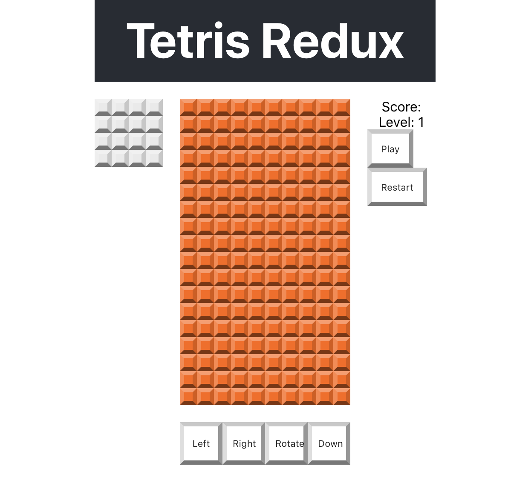

Tetris has a couple controls. Blocks can be moved left, right,
and down. They can also be rotated.

The original game used a joystick and button. This game will use
four buttons.


The next step is to create a component with four buttons. These
buttons will all issue actions.

Redux allows you to make changes to applications state from
any component by issuing an action.

Without Redux, changes in state would have to be passed up and
down the component hierarchy and state would have to be managed by
a shared parent component.

# Adding Controls

The first step is to make a new component to hold the buttons.

> [action]
>
> Make a new file `/src/components/controls.js` that contains the following stub code for the controls component class (we'll build this out later):
>
```JS
import React, { Component } from 'react'
>
class Controls extends Component {
>
  render() {
    return (
      <div className="controls">
        {/* left */}
        <button className="control-button" onClick={(e) => {
>
        }}>Left</button>
>
        {/* right */}
        <button className="control-button" onClick={(e) => {
>
        }}>Right</button>
>
        {/* rotate */}
        <button className="control-button" onClick={(e) => {
>
        }}>Rotate</button>
>
        {/* down */}
        <button className="control-button" onClick={(e) => {
>
        }}>Down</button>
>
      </div>
    )
  }
}
>
export default Controls
```

# Style the Controls

Add some styles to the controls container. Notice here we are mapping this element to grid area "b".

> [action]
>
> Add some new styles for the controls in `/src/index.css`
>
```CSS
/* controls */
.controls {
  grid-area: b;
  display: flex;
  flex-direction: row;
}
```

The controls container will use the [Flex Box](https://developer.mozilla.org/en-US/docs/Learn/CSS/CSS_layout/Flexbox) for layout. Flex Box is a one dimensional layout. All of the buttons in the controls container are arranged in a horizontal row along a single axis.


> [action]
>
> Define some styles for the control buttons in `/src/index.css`
>
```CSS
/* We want the buttons to be square with a width of 25% of grid board. The grid is 10 tiles wide, so the size of the buttons should be (2.5 * tile size) */
.control-button {
  --size: calc(var(--tile-size) * 2.5);
  width: var(--size);
  height: var(--size);
  text-align: center;
  display: block;
  border-width: 5px;
  border-top-color: var(--button-color-t);
  border-left-color: var(--button-color-l);
  border-right-color: var(--button-color-r);
  border-bottom-color: var(--button-color-b);
}
```

# Add to App.js

Let's add our controls into our app!

> [action]
>
> Add the following to `/src/App.js`:
>
```js
import React, { Component } from 'react';
>
import GridBoard from './components/grid-board'
import NextBlock from './components/next-block'
import ScoreBoard from './components/score-board'
[bold]import Controls from './components/controls'[/bold]
>
import './App.css';
>
class App extends Component {
  render() {
    return (
      <div className="App">
        <header className="App-header">
          <h1 className="App-title">Tetris Redux</h1>
        </header>
        <GridBoard />
        <NextBlock />
        <ScoreBoard />
[bold]        <Controls />[/bold]
      </div>
    );
  }
}
>
export default App;
```

You should see the following in your browser:



Obviously these controls don't do anything yet, but we'll build them out in a future chapter

# Now Commit

>[action]
>
```bash
$ git add .
$ git commit -m 'Added initial controls'
$ git push
```
