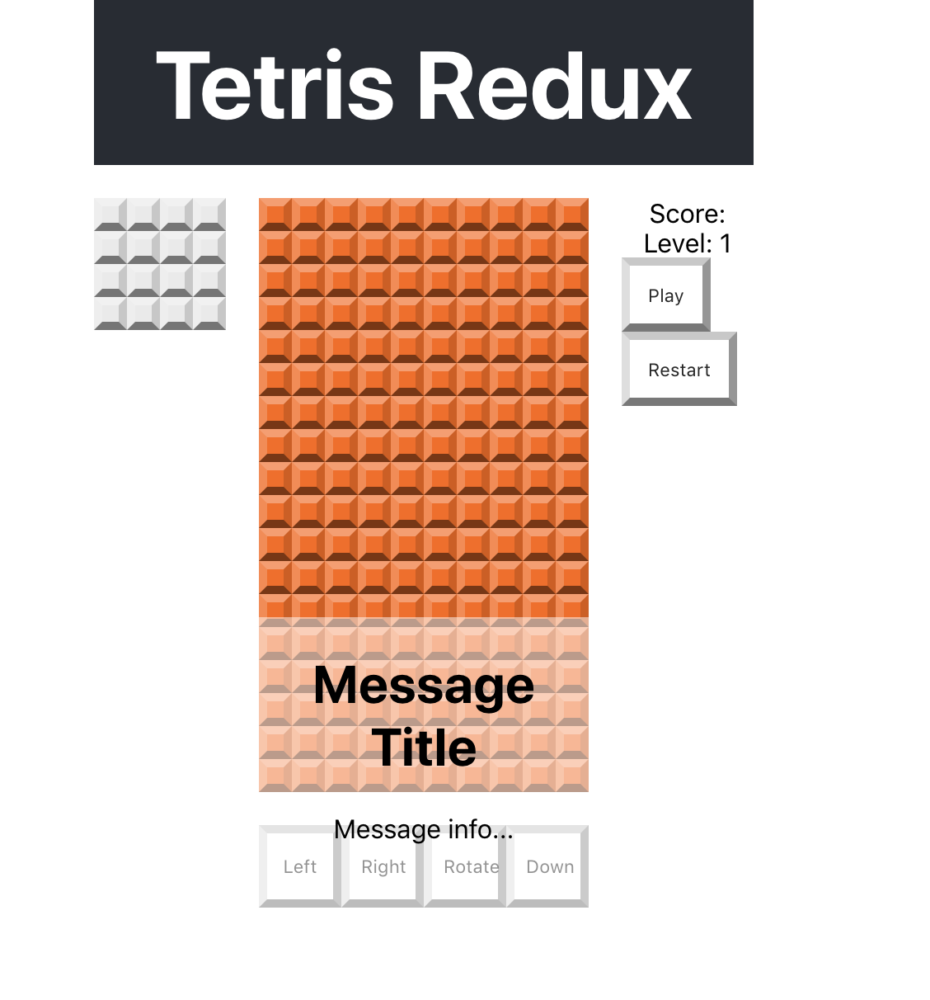

The game will need to display messages about the game
state. Messages will be 'Game Over' and 'Paused' for
now but can be expanded to showing score, advancing
to a new level, and more.


Let's lay out our usual basic requirements:

- The Message Popup will be a component connected to application state.
- This component will appear above the game board in the center of the screen.
- The HTML element that holds this component needs to display over the rest of the component elements.
- It won't be arranged with Grid and instead will use CSS
absolute position. This allows us to place this anywhere on the screen regardless of the other elements.

# Building the message popup

> [action]
>
> Add a new file: `/src/components/message-popup.js` with the following code:
>
```JS
import React, { Component } from 'react'
>
// Displays a message
class MessagePopup extends Component {
>
  render() {
    return (
      <div className='message-popup'>
        <h1>Message Title</h1>
        <p>Message info...</p>
      </div>
    )
  }
}
>
export default MessagePopup
```

# Give Some Flair to the Message

Use styles to position and display the Message Popup.

> [action]
>
> Add the following to `/src/index.css`:
>
```CSS
/* Message Popup - These styles apply to the `MessagePopup` container. With `position:absolute` this element can be placed anywhere on the screen, `left, top, transform:translate` perform this function.*/
.message-popup {
  position: absolute;
  left: 50%;
  top: 50%;
  transform: translate(-50%, -50%);
  width: calc(var(--tile-size) * 10);
  height: calc(var(--tile-size) * 10);
  background-color: rgba(255, 255, 255, 0.5);
  text-align: center;
}
>
/* This style is applied only when the message popup container
has both `message-popup` class and the `hidden` class. In this
case the Message Popup is not displayed */
.message-popup.hidden {
  display: none;
}
```

# Add to App.js

Import and add the message popup component to the _bottom_ of App. **It should be the last component in App.**

> [action]
>
> Add the following to `/src/App.js`
>
```js
import React, { Component } from 'react';
>
import GridBoard from './components/grid-board'
import NextBlock from './components/next-block'
import ScoreBoard from './components/score-board'
import Controls from './components/controls'
[bold]import MessagePopup from './components/message-popup'[/bold]
>
import './App.css';
>
class App extends Component {
  render() {
    return (
      <div className="App">
        <header className="App-header">
          <h1 className="App-title">Tetris Redux</h1>
        </header>
        <GridBoard />
        <NextBlock />
        <ScoreBoard />
        <Controls />
[bold]        <MessagePopup />[/bold]
      </div>
    );
  }
}
>
export default App;
```

Your browser should now look like the following:



Alright, we've got our components in place! Now it's time to make them do something!

# Now Commit

>[action]
>
```bash
$ git add .
$ git commit -m 'Added initial message popup'
$ git push
```
