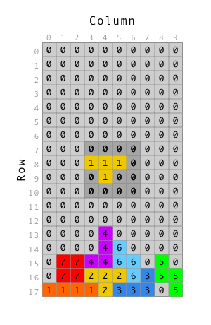

1. ~~Implement the overall grid square~~
1. ~~Implement the game board~~
1. ~~Implement the "next block" area~~
1. ~~Implement the score board~~
1. ~~Arrange the layout of the game~~
1. ~~Implement the controls~~
1. ~~Implement the message popup~~
1. ~~Implement the actions and reducers~~
1. ~~Do some code organizing and cleanup~~
1. ~~Implement state and shapes~~
1. **Connect each component up to state and reducers**
    1. ~~NextBlock~~
    1. **GridBoard**
        1. **Connect the `grid-board` component**
        1. **Implement the `mapStateToProps` function**
        1. **Implement the `mapDispatchToProps` function**
        1. **Build out the board to show shapes and calculate their position**
1. Implement block rotation
1. Implement moving blocks
1. Building a timer system
1. Implementing Game Over and Restart

You want to display the grid board from state. This is the core rendering feature of the game.

The `GridBoard` component displays an array of `GridSquare`s. It will also map the current shape block at it's rotation into this grid at the x, and y.

Tapping the left, right, rotate, down buttons update game state which in turn triggers this component to update. Updates are also generated as the timer triggers move down actions.

Remember that colors are represented as integer values:

- Color 0: 
- Color 1: 
- Color 2: 
- Color 3: 
- Color 4: 
- Color 5: 
- Color 6: 
- Color 7: 

These colors would map to the grid like this:


The grid also needs to map the current block onto the grid. The current block is one of the shape arrays at it's rotation. This is a 4 by 4 grid.



The block is mapped onto the grid. The image above
shows shape 2, rotation 0 at x = 3 and y = 7.

# Get the grid with useSelector

You need to connect the `GridBoard` component to Redux to do this you
need `connect` from `React-Redux`.

> [action]
>
> Import `connect` from 'react-redux' at the top of `/src/components/GridBoard.js`:
>
```js
import { useSelector } from 'react-redux'
```

# Get game data from state

Get the game object and deconstruct it into each of it's properties.

> [action]
>
```js
...
export default function GridBoard(props) {
	const game = useSelector((state) => state.game)
	const { grid, shape, rotation, x, y, isRunning, speed } = game
  ...
}
```

Note! at this step you'll have an error since `grid` will be declared twice! You're going to fix that in a moment.

# Mapping the Grid to GridSquares

Previously the grid was mocked up. Now it's time replace this code with code that generates a grid from game state and maps the current shape block on to the grid.

The `makeGrid()` method is responsible for this. `Array.map` is a good tool here since we want to transform the integer values into Grid Squares with color.

You'll need to map the row arrays then map each row to get the value at each column. These values are used to generate grid squares.

> [action]
>
> Import `shapes` from utils.js. Add the following at the top of `GridBoard.js`
>
```JS
...
import { shapes } from '../utils'
...
```

Next map the current block shape into the grid.

> [info]
>
> How do we _really_ do this? The source Grid is two dimensional, but the output Grid will just be one dimensional. You can use `Array.map()` to map across all rows, and then use `Array.map()` again to map across each column. Inside this second map function is where you'll generate Grid Squares.

Remember that the value assigned to each location on the grid is an _integer representing the color of each square_.

Next map the shape on to the grid. The shape is also represented by an integer value.

When Grid Squares are created, find the color for the square by looking at the shape array. If there is a 1 in the shape array, use the shape index as the color.

But enough talking, let's crank this out!

> [action]
>
> Rewrite the `makeGrid` method in `/src/components/grid-board.js` that follows the description as outlined above:
>
```JavaScript
import React from 'react'
import { useSelector } from 'react-redux'
import GridSquare from './GridSquare'
import { shapes } from '../utils'
>
export default function GridBoard(props) {
	const game = useSelector((state) => state.game)
	const { grid, shape, rotation, x, y, isRunning, speed } = game
>
	const block = shapes[shape][rotation]
  const blockColor = shape
  // map rows
  const gridSquares = grid.map((rowArray, row) => {
    // map columns
    return rowArray.map((square, col) => {
      // Find the block x and y on the shape grid
      // By subtracting the x and y from the col and the row we get the position of the upper left corner of the block array as if it was superimposed over the main grid
      const blockX = col - x
      const blockY = row - y
      let color = square
      // Map current falling block to grid.
      // For any squares that fall on the grid we need to look at the block array and see if there is a 1 in this case we use the block color.
      if (blockX >= 0 && blockX < block.length && blockY >= 0 && blockY < block.length) {
        color = block[blockY][blockX] === 0 ? color : blockColor
      }
      // Generate a unique key for every block
      const k = row * grid[0].length + col;
      // Generate a grid square
      return <GridSquare
              key={k}
              color={color} />
    })
  })
>
	return (
		<div className='grid-board'>
			{gridSquares}
		</div>
	)
}
```

At this point the grid should display with the gray squares. This is the empty color.

No visual changes quite yet, but make sure everything still loads correctly in the browser! Our Grid Board now **uses Redux/Flux to manage application state!** We also covered working with **systems that manage and merge complex arrays** in a lot more detail with the board, and have gotten _even more_ practice with **using functional programming methods like `map`!**

# Now Commit

>[action]
>
```bash
$ git add .
$ git commit -m 'Added connection for grid board'
$ git push
```
