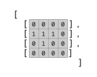
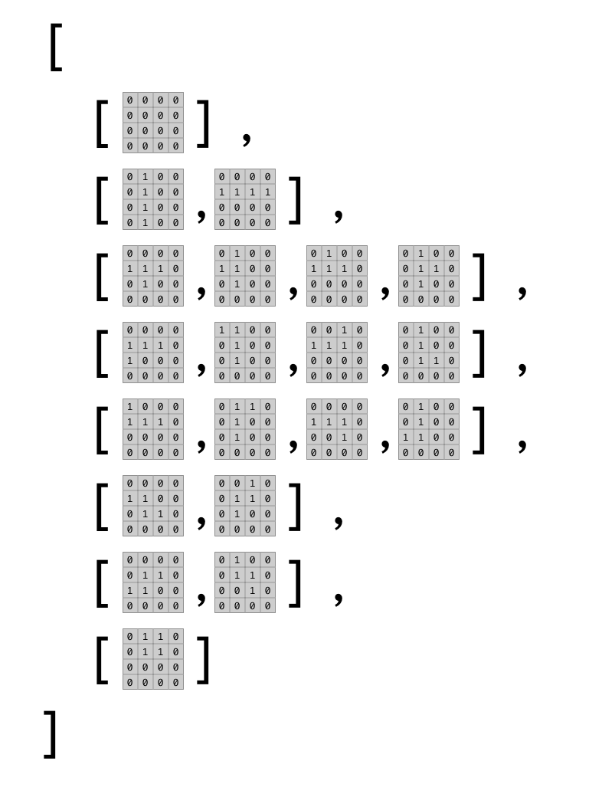

The game will work by managing it's state in a
series of arrays stored in Redux. Manipulating
and comparing these arrays will determine what
the game shows and how the game plays. 

# Introduction 

The game is managed with Arrays. Much of the work 
of running the game will revolve around mapping
and comparing Arrays. 

Nested arrays represent a two dimensional data 
structure. This is refelcts the two dimensional
grid the game is played on. 

The game board is an 18 by 10 grid. 


Each shape will be stored as a 4 by 4 grid. 
These arrays are stored as arrays of rows 
where the value represents a column. The 
values are either 0 (empty) or 1 (draw a block). 
For example the T shaped block could be 
visualized like this: 



Shapes can be rotated so there will be a 4 by 
4 grid representing each rotation. The array of 
shapes and their rotations could be visualized like this: 



To access the array containg the shape data you'll 
use the index of the shape followed by the index of
the rotation e.g.

`shapes[shapeIndex][rotationIndex]`

This would return the 4 by 4 two dimensional array 
containing the 0s and 1s describing one of the shapes
e.g. `shapes[2][0]` would give the T shape. 

Game state is an object stored in Redux. 
This object will have all of the properties that manage 
the game. Here is a list of all properties with 
a short description. 

- **grid** : (Array) nested array describing the game board
- **shape** : (Int) **index** of current shape block controlled by player
- **rotation** : (Int) rotation **index** of the current shape block
- **x** : (Int) horizontal position of the current shape block on the game board
- **y** : (Int) vertical position of the current shape block
- **nextShape** : (Int) **index** of the next shape to play
- **isRunning** : (Bool) true when game is running, false when paused
- **score** : (Int) number of points scored
- **speed** : (Int) speed of falling blocks
- **gameOver** : (Bool) true when game is over

**Game Board**

The Gameboard will be defined as a set of nested 
Arrays representing rows and columns. There will 
be 18 rows of 10 columns. 

Each grid square will be represented by an 
integer, 0 is an empty square, 1-7 represent a 
color. All of the color values have a corresponding 
CSS class name in the stylesheet.

The gameboard array might look like this: 

```JavaScript
[[0,0,0,0,0,0,0,0,0,0], 
 [0,0,0,3,3,3,0,0,0,0],
 [0,0,0,0,3,0,0,0,0,0],
 ... 14 more rows ...
 [0,0,0,0,0,0,0,0,0,0]
]
```

The grid above shows the game board with a
T shaped block in color three is near the top. 

## Challenge

You need a function that will generate a default 
empty array. 

Write a function in 'src/utils/index.js'. 

This function needs to return an array containing
18 arrays, each of the nested arrays should contain 
ten 0s. This represents an empty game board. 

```JavaScript
// Returns the default grid
export const gridDefault = () => {
  const rows = 18
  const cols = 10
  const array = []

  // Fill array with 18 arrays each containing 
  // 10 zeros (0)

  return array
}
```

**Shapes**

Shapes will be mapped onto the board. There are 
There are 7 shapes. I'll represent them here as 
letters. The letters approximate the outline of 
the shape. 

- I (has two rotations)
- T (has four rotations)
- L (has four rotations)
- J (has four rotations)
- Z (has two rotations)
- S (has two rotations)
- O (has one rotation)

Each shape will be mapped to a two dimensional 
array with a 1 where the shape should draw and 
0 every else. 

Each shape can be rotated and it's rotations 
will be grouped together into an array. 

All of the rotation arrays will be grouped 
into a master shape array. 

There will be an extra empty shape at the 0
index. 

The color of each shape corresponds to it's 
index in the top level of the shape Array. 
For example, the T shape is color 2, and the I
shape is color 1. 

Add the following to 'src/utils/index.js'.

```JavaScript
// Define block shapes and their rotations as arrays.
export const shapes = [
  // none
  [[[0,0,0,0],
    [0,0,0,0],
    [0,0,0,0],
    [0,0,0,0]]],
                       
  // I
  [[[0,0,0,0],
    [1,1,1,1],
    [0,0,0,0],
    [0,0,0,0]],

   [[0,1,0,0],
    [0,1,0,0],
    [0,1,0,0],
    [0,1,0,0]]],

  // T
  [[[0,0,0,0],
    [1,1,1,0],
    [0,1,0,0],
    [0,0,0,0]],

   [[0,1,0,0],
    [1,1,0,0],
    [0,1,0,0],
    [0,0,0,0]],

   [[0,1,0,0],
    [1,1,1,0],
    [0,0,0,0],
    [0,0,0,0]],

   [[0,1,0,0],
    [0,1,1,0],
    [0,1,0,0],
    [0,0,0,0]]],

  // L
  [[[0,0,0,0],
    [1,1,1,0],
    [1,0,0,0],
    [0,0,0,0]],

   [[1,1,0,0],
    [0,1,0,0],
    [0,1,0,0],
    [0,0,0,0]],

   [[0,0,1,0],
    [1,1,1,0],
    [0,0,0,0],
    [0,0,0,0]],

   [[0,1,0,0],
    [0,1,0,0],
    [0,1,1,0],
    [0,0,0,0]]],

  // J
  [[[1,0,0,0],
    [1,1,1,0],
    [0,0,0,0],
    [0,0,0,0]],

   [[0,1,1,0],
    [0,1,0,0],
    [0,1,0,0],
    [0,0,0,0]],

   [[0,0,0,0],
    [1,1,1,0],
    [0,0,1,0],
    [0,0,0,0]],

   [[0,1,0,0],
    [0,1,0,0],
    [1,1,0,0],
    [0,0,0,0]]],

  // Z
  [[[0,0,0,0],
    [1,1,0,0],
    [0,1,1,0],
    [0,0,0,0]],

   [[0,0,1,0],
    [0,1,1,0],
    [0,1,0,0],
    [0,0,0,0]]],

  // S
  [[[0,0,0,0],
    [0,1,1,0],
    [1,1,0,0],
    [0,0,0,0]],

   [[0,1,0,0],
    [0,1,1,0],
    [0,0,1,0],
    [0,0,0,0]]],

  // O
  [[[0,1,1,0],
    [0,1,1,0],
    [0,0,0,0],
    [0,0,0,0]]]
]
```

**Generate Random Shapes**

The game needs to generate a random shape from the 
shape array. Add a function to handle this. 

```JavaScript
// Return a random shape
export const randomShape = () => {
  return random(1, shapes.length - 1)
}
```

This function returns a number from 1 to the number of 
items in `shapes`. We don't want the first item it's 
the empty shape. 

This function won't return a shape, 
instead it will return the index of a shape. The 
game will use the index to get the shape. 

**Game State**

Write a function that generates the default state 
of the game. 

This function returns the default object used redux 
with all of the properties reflecting a default 
game state.

```JavaScript
// Return the default state for the game
export const defaultState = () => {
  return {
    grid: gridDefault(),
    shape: randomShape(),
    rotation: 0,
    x: 5,
    y: -4,
    nextShape: randomShape(),
    isRunning: true,
    score: 0,
    speed: 1000,
    gameOver: false
  }
}
```

The default properties create an empty grid, 
get a new random shape, set th rotation of the 
shape to 0, position the shape at 5 on the and 
-4 on the y (should put the shape in the center
of the grid above the top), set the index to the 
next shape to a new random shape, set the score 
to 0, and game over to false. 

## Conclusion


## Resources

 
