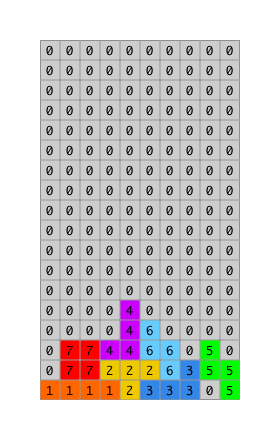

Display the grid board from state. This is the core rendering
feature of the game. 

The grid board is a two dimensional array where each each 
array at the top level represents a row, and each of these 
row arrays contains integers that represent the contents at
each column in the row. 

These integer values map to colors. 

- Color 0: 
- Color 1: 
- Color 2: 
- Color 3: 
- Color 4: 
- Color 5: 
- Color 6: 
- Color 7: 

These colors would map to the grid like this: 



The grid also needs to map the current block onto the 
grid. The current block is one of the shape arrays at 
it's rotation. This is a 4 by 4 grid. 


The block is mapped to onto the grid. THe image above 
shows shape 2, rotation 0 at x = 3 and y = 7. 

# Introduction 

The `GridBoard` component displays an array of `GridSquare`s. 
It will also map the current shape block at it's rotation into 
this grid at the x, and y. 

Tapping the left, right, rotate, down buttons update game state 
which in turn triggers this component to update. Updates are 
also generated as the timer triggers move down actions. 

## Challenges

**Import connect**

You need to connect the `GridBoard` component to Redux to do this you 
need `connect` from 'react-redux'.

Import `connect` from 'react-redux' at the top of the `GridBoard`
component. 

**Map state to props**

Define a `mapStateToProps` method. This method takes in state 
as a parameter. 

Return an object that maps the following properties from state 
to these props: 

```JavaScript
grid: state.game.grid,
shape: state.game.shape,
rotation: state.game.rotation,
x: state.game.x,
y: state.game.y,
speed: state.game.speed,
isRunning: state.game.isRunning
```

This component will issue `MOVE_DOWN` actions. It needs to call 
on the `moveDown` action. 

**Map dispatch to props**

Import the `moveDown` action and map it to props. 

Add a `mapDispatchToProps` method that returns an Object 
containing the actions issued by this component. 

**Connect the component**

Use the connect method to connect `mapStateToProps`, 
`mapDispatchToProps` and the `GridBoard` component. 

**Mapping the Grid to GridSquares**

Previously the grid was mocked up. Now it's time replace 
this code with code that generates a grid from game state 
and maps the current shape block on to the grid. 

The `makeGrid()` method is responsible for this. 
`Array.map` is a good tool here since we want to 
transform the integer values into Grid Squares with 
color. 

The source Grid is two dimensional the ouput Grid will 
just be one dimensional. Use `Array.map()` to map 
across all rows, inside use `Array.map()` again to map
across each column. Inside this second map function
generate Grid Squares. 

Let's go over that again. You need to map the row arrays
then map each row to get the value at each column. These 
values are used to generate grid squares. 

Along the way you'll look at shape block and map that into
the grid. 

The value assigned to each location on the grid is an integer 
representing the color of each square.

Next you'll need to map the shape on to the grid. The 
shape is represented by an integer value. 

When Grid Squares are created find the color for the 
square by looking at the shape array. If there is a 1
in the shape array use the shape index as the color. 

```JavaScript
makeGrid() {
  const { grid, shape, rotation, x, y } = this.props
  const block = shapes[shape][rotation]
  const blockColor = shape
  // map rows
  return grid.map((rowArray, row) => {
    // map columns
    return rowArray.map((square, col) => {
      // Find the block x and y on the shape grid
      const blockX = col - x
      const blockY = row - y
      let color = square
      // Map current falling block to grid. 
      if (blockX >= 0 && blockX < block.length && blockY >= 0 && blockY < block.length) {
        color = block[blockY][blockX] === 0 ? color : blockColor
      }
      // Generate a unique key for every block
      const k = row * grid[0].length + col;
      // Generate a grid square
      return <GridSquare
              key={k}
              square={square}
              color={color}>{square}
            </GridSquare>
    })
  })
}
```

The code above collects properties mapped to props from state. 
Then it gets the block which is the current shape the player 
is controlling. Then we map over the rows and then again map 
the columns. 

To map the shape block onto the grid we need to use the x and y
values. By subtracting the x and y from the col and the row
we get the position of the position of the upper left corner 
of the block array as if it was superimposed over the main
grid. It's possible some or all of the block array may be 
off the top left or right of the grid. For any squares that 
fall on the grid we need to look at the block array and see
if there is a 1 in this case we use the block color.

## Conclusion


## Resources

 
